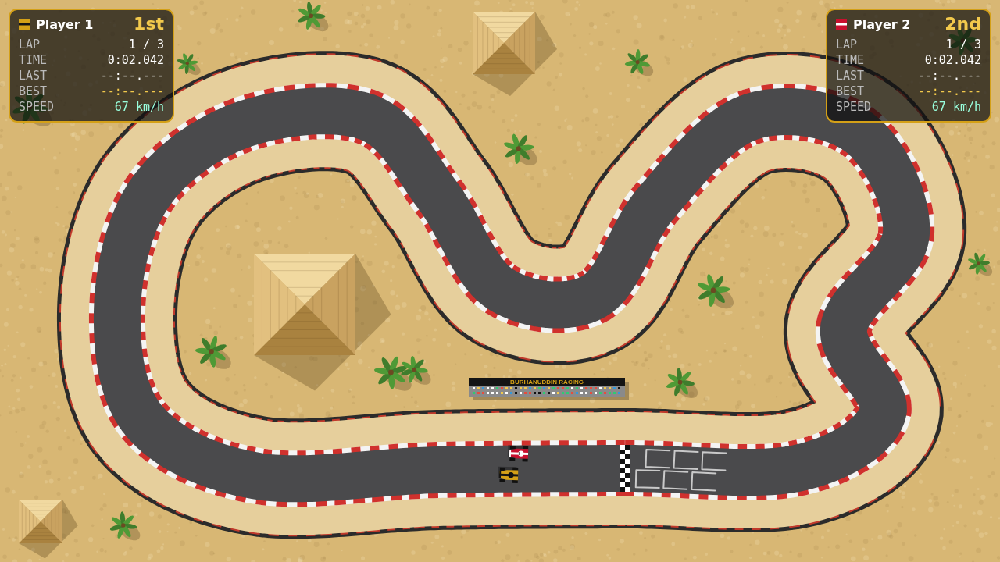
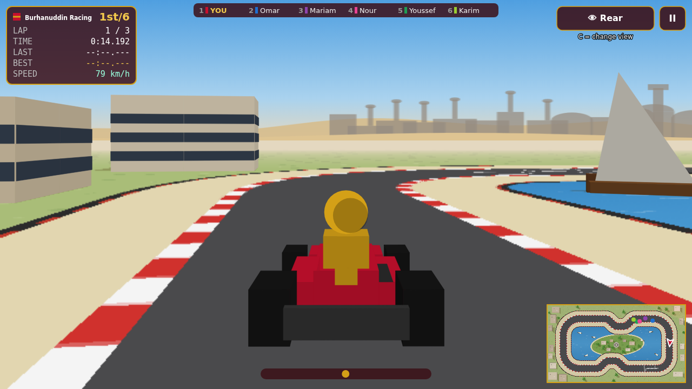
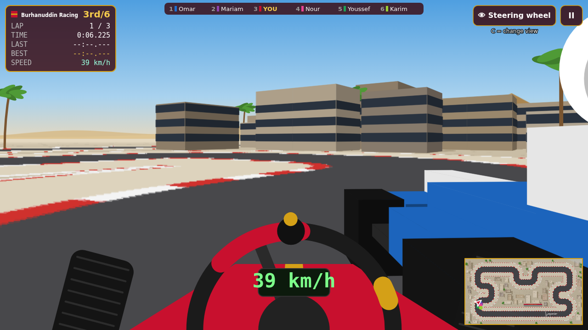
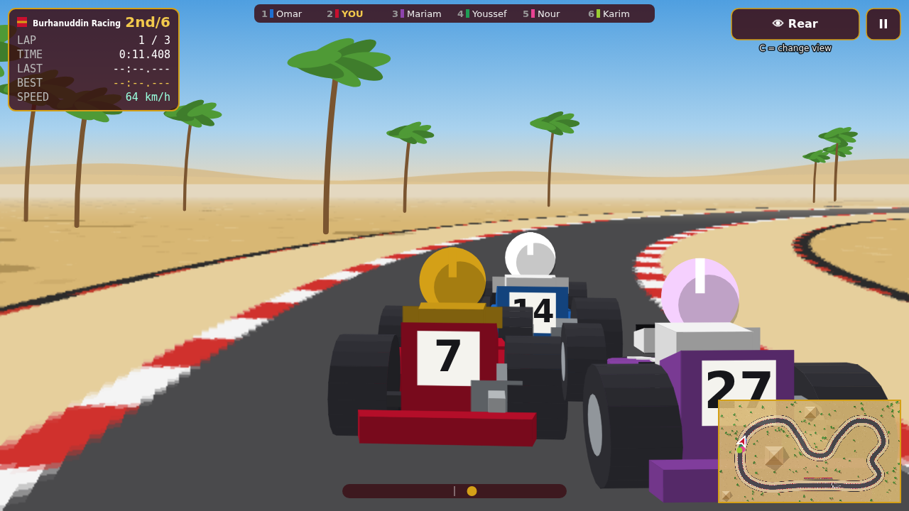

# Burhanuddin Racing — Cairo Karting 🏁

A go-kart racing game set in Cairo, built for playing on a laptop — with a
trackpad or the keyboard. See [PLAN.md](PLAN.md) for the full plan and what's next.

## How to play

1. Download or clone this folder.
2. Double-click **`index.html`** (opens in Chrome, Edge, Firefox or Safari). Nothing to install.
3. Click **START**. In the garage pick your team (◀ ▶), buy upgrades, choose a **track** and a **mode**, and click **RACE**.

Everything can be clicked — you never need the keyboard for the menus.

### Driving with the trackpad (the default)

- **Steer:** slide your finger left and right. The further from the middle, the harder
  you turn. The steering wheel on screen shows exactly how much you're turning.
- **Accelerate:** automatic.
- **Brake:** press and hold the trackpad (or hold Space).

### Driving with the keyboard

Switch **Controls** to *Keyboard* on the title screen (or press T there).
↑ / W = accelerate · ↓ / S = brake · ← → / A D = steer.

### Views

Click the 👁 button (top right) or press **C** to switch between:

| View | What you see |
|---|---|
| **Steering wheel** (main) | From the driver's seat: the wheel, your hands, the kart's nose |
| **Rear** | A camera following behind your kart |
| **Top down** | The whole track from above |

A minimap in the corner shows the whole track in the 3D views.

**II** / P = pause · **Esc** = back to the garage.

## Tracks

Pick the track in the garage (◀ ▶ or the ← → keys). Each track keeps its own best lap.

| Track | What it's like |
|---|---|
| **Giza Pyramids Circuit** | Wide, sandy and flowing, with the three pyramids in the middle |
| **Cairo City Circuit** | Tight downtown streets between the buildings, with zig-zags and a square notch |
| **Nile Corniche** | Fast straights and big sweeping corners around the river, with Zamalek island, the Cairo Tower and feluccas |

## Modes

Pick the mode next to the track in the garage.

- **Race the computer** — you start at the back of a 6-kart grid and the computer
  drivers (Omar, Mariam, Youssef, Nour and Karim) start in front. You win prize money.
  The computer drivers' top speed depends on the difficulty (press D on the title screen):

  | Difficulty | Their top speed | Prize |
  |---|---|---|
  | Easy | about 60 km/h | ×1 |
  | Medium | about 78 km/h | ×1.5 |
  | Hard | about 100 km/h | ×2 |

  Your own kart starts at 90 km/h and reaches 104 km/h with a fully upgraded engine,
  so on Hard you'll need upgrades to keep up.
- **YOU (race your ghost)** — just you against a see-through copy of your best race
  on that track, driving *exactly* the way you drove it (same line, same speed, same
  mistakes). A gauge at the top shows how far ahead (green) or behind (red) your ghost
  you are, updated at every checkpoint. Beat your best and the ghost gets faster.
  Every race you finish is recorded, so finishing a normal race also sets a ghost —
  and if you haven't set one yet, your first run in YOU mode becomes it. There are no prizes in this mode.

Tips: stay off the sand — it slows you right down. Brake *before* the corner, not in it.
If you cut across the sand and miss a checkpoint the lap won't count.
Your best lap on each track is saved as the track record.

## What's in the game so far

- Three Cairo tracks: Giza Pyramids Circuit, Cairo City Circuit and Nile Corniche (3 laps each)
- YOU mode: race the ghost of your own best time on each track
- Three views: steering wheel (3D, from the driver's seat), rear (3D), top down
- Trackpad driving (steer by sliding, auto-accelerate, hold to brake) or keyboard
- Realistic-ish kart handling: grip, sliding, skid marks, sand run-off, tyre walls
- You against 5 computer drivers on a 6-kart grid
- Pick your team: Burhanuddin Racing (red & gold), Mercedes, BMW, Ferrari,
  Red Bull or McLaren (team colours only — no official logos)
- Computer drivers follow a racing line, brake for corners, overtake, and make the odd mistake
- Easy / Medium / Hard difficulty with top speeds of 60 / 78 / 100 km/h (remembered between games)
- Live race order at the top of the screen, full results table at the end
- Lap timer, last/best lap, speedometer, saved track record
- Career mode: prize money for every finishing position, and a garage with
  4 upgrades × 5 levels that really change how the kart drives

## Make it your own

- **Change a track:** edit the corners in `src/tracks/giza.js`, `cairo.js` or `nile.js` and reload the page.
  Each corner is `[x, y, radius]` — move it, or change the radius to make the turn tighter or wider.
- **Make a new track:** copy one of those files, give it a new `id` and add the id to `TRACK_ORDER` in `src/track.js`
  and a `<script>` line in `index.html`.
- **Change how fast the computer drivers are:** `topKmh` for each difficulty in `DIFFICULTIES` in `src/ai.js`.
- **Change how the trackpad steers:** `TRACKPAD_FULL_LOCK` in `src/input.js` (smaller = more sensitive).
- **Move the cameras:** `CAMERAS` at the top of `src/view3d.js`.
- **Change how the kart drives:** edit `KART_BASE_STATS` at the top of `src/kart.js`.
- **Add a team or change team colours:** `TEAMS` in `src/teams.js`.
- **Change prices, prizes or how much upgrades help:** everything is in `src/economy.js`.
- **Rename the computer drivers or change their colours / skill:** `AI_DRIVERS` in `src/ai.js`.

## Code map

| File | What it does |
|---|---|
| `index.html` | The page — open it to play |
| `src/main.js` | Game loop and screens (menu, race, pause), switching views |
| `src/input.js` | Trackpad and keyboard controls |
| `src/view3d.js` | The 3D views: ground, sky, 3D karts/pyramids/palms, steering wheel |
| `src/kart.js` | Kart physics and drawing |
| `src/track.js` | Turns points into a track; drawing helpers (pyramids, palms, grandstand) |
| `src/tracks/` | One file per track (`giza.js`, `cairo.js`, `nile.js`) |
| `src/ghost.js` | Records your races and replays your best one as the ghost |
| `src/ai.js` | Computer drivers: racing line, braking, overtaking |
| `src/economy.js` | Prices, prizes, upgrades and the saved career |
| `src/garage.js` | The garage screen |
| `src/teams.js` | The teams players can pick and their kart colours |
| `src/race.js` | Countdown, laps, checkpoints, positions, results |
| `src/hud.js` | Lap panels, countdown, menus |
| `src/save.js` | Saves records in the browser |
